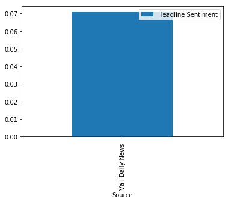

# Introduction to Web Scraping 

## What this repository is

A practical, interactive, beginner-friendly introduction to Python, web scraping, sentiment analysis, and data visualization. No previous experience required, but we will cover a ton of material quickly. The bulk of the material is in a Python Notebook created with Google Colab.

You can't learn EVERYTHING here, but you can learn enough to get excited and comfortable to keep working and learning on your own! By the end of the course, you'll have a tool you can start using today, and place to get started from building your own tools. 

You will start with no data, and make this Bar Graph Showing Vail, CO Headline Sentiment: 

#### Getting Started:

##### Tools 

1) Web browser to use Google Colab, or your own way to open a Python Notebook.

2) Python Notebook Open in one of three ways: 
	1) You can open the Colab notebook directly from this link: [https://colab.research.google.com/github/nicholasgriffen/intro-web-scraping/blob/master/NewsPageAnalysis.ipynb](https://colab.research.google.com/github/nicholasgriffen/intro-web-scraping/blob/master/NewsPageAnalysis.ipynb)
	2) Or open the copy from this repo in Colab by going to File > Open Notebook > Github and pasting this URL `https://github.com/nicholasgriffen/intro-web-scraping/blob/master/NewsPageAnalysis.ipynb`
	3) Or click the "Open in Colab" button here: [https://github.com/nicholasgriffen/intro-web-scraping/blob/master/NewsPageAnalysis.ipynb](https://github.com/nicholasgriffen/intro-web-scraping/blob/master/NewsPageAnalysis.ipynb)

Make a copy by clicking `file` and `make copy` or `save to drive`

## Before we build

### HTML Basics

HTML is one of the main building blocks of the web!

###### Some common Tags(Elements):

- `<html>`	designates an HTML document
- `<head>`	contains undisplayed information about the document
- `<title>`	Creates a title for the document
- `<body>`	contains displayed information
- `<header>, <main>, <footer>` denotes which part of the page elements belong

- `<h1> - <h6>` create section headings (h1 biggest, h6 Smallest)
- `
` creates paragraphs
- `` (anchor), activates a link in the page
- `<ul>, <ol>` creates lists
  - `<li>` contains items in lists
- ` `	Inserts a single line break

###### Self-closing Tags:
most HTML tags require an opening and a closing tag. There are a few however that do not:

- `` creates an image in the page
- ` ` creates a break in the content
- `<input type="">` creates an input field
- `
`	Creates a line in the page 

###### IDs, Classes
IDs and classes are very similar.
These are used to target specific elements(You'll see more examples in CSS section).
- `<h1 id="profile-header"></h1>`
- `<h1 class="subject-header"></h1>`

- IDs should only be used once on a page. IDs can also be used to bring the user to a specific part of the page. `your-site/#profile-picture` will load the page near the profile picture. 
- Classes can be used multiple times on a page. 

See More tags [here](https://www.w3schools.com/tags/ref_byfunc.asp)

Learn more HTML [here](https://www.w3schools.com/Html/)

	
#### Inspect element of a web page

- Go to a web page
- right click
- select `inspect element	`

### Python

We're going to be using python to do our web scraping. Below are external modules used in the Notebook.

##### Requests

We will use the [Requests](http://docs.python-requests.org/en/master/) module to visit a URL and get web elements. 

##### Beautiful Soup

We will use [Beautiful Soup](https://www.crummy.com/software/BeautifulSoup/) is used to parse HTML and extract the information we need.

##### Pandas

We'll use [pandas](https://pandas.pydata.org/) to do some analysis and visulizations on our data 

##### NLTK

We'll use [NLTK](https://www.nltk.org/)(Natural Language Toolkit) to do some simple natural language processing on some text. 

Brought to you by [Galvanize](http://galvanize.com)
